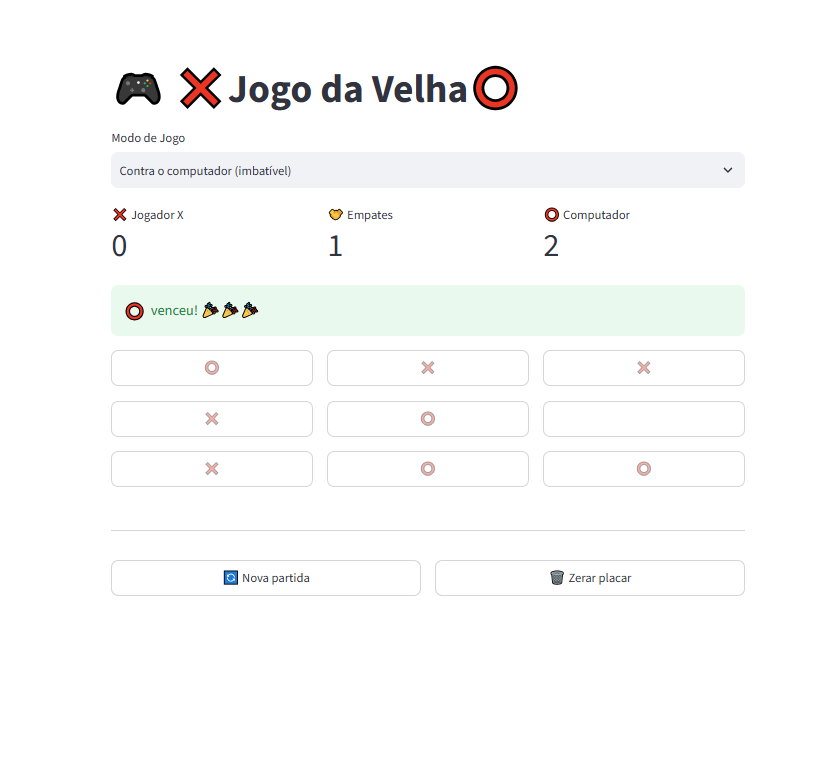

# Tic_Tac_Toe
# 🎮 Jogo da Velha (Tic Tac Toe) com Python e Streamlit

Um jogo da velha feito em **Python** com **Streamlit**, com três modos de jogo: dois jogadores, contra o computador no modo fácil e contra o computador **imbatível**, que usa o algoritmo **minimax**. 🚀

---

## 📸 Preview



---

## ✨ Funcionalidades

- 👥 **Modo 2 jogadores**: X e O se alternam no mesmo computador
- 🤖 **Modo fácil**: o computador joga em casas aleatórias
- 🧠 **Modo imbatível**: o computador usa minimax e nunca perde (o melhor que você consegue é empatar)
- 🏆 **Placar** com vitórias de X, vitórias de O (ou do computador) e empates
- 🟦 **Destaque da linha vencedora**
- 🔄 Botão de **nova partida** (mantém o placar)
- 🗑️ Botão de **zerar placar**
- ♻️ O placar é reiniciado automaticamente ao trocar de modo

---

## 🛠️ Tecnologias

| Tecnologia | Uso |
|---|---|
| [Python 3](https://www.python.org/) | Lógica do jogo |
| [Streamlit](https://streamlit.io/) | Interface web |
| `random` (biblioteca padrão) | Jogadas aleatórias e desempate entre boas jogadas |

---

## 📦 Como instalar e rodar

### 1. Clone o repositório

```bash
git clone https://github.com/rebecaccsilva/Tic_Tac_Toe.git
cd Tic_Tac_Toe
```

### 2. (Opcional) Crie um ambiente virtual

```bash
python -m venv venv

# Windows
venv\Scripts\activate

# Linux / macOS
source venv/bin/activate
```

### 3. Instale o Streamlit

```bash
pip install streamlit
```

### 4. Rode o jogo

```bash
streamlit run tic_tac_toe.py
```

O navegador abre sozinho em `http://localhost:8501`.

> 💡 Se a porta 8501 já estiver em uso, rode com outra: `streamlit run tic_tac_toe.py --server.port 8502`

---

## 🕹️ Como jogar

1. Escolha o **modo de jogo** no menu no topo da página.
2. Clique numa casa vazia para jogar. Você é o **❌** e começa sempre.
3. Vence quem completar uma linha, coluna ou diagonal com três símbolos iguais.
4. Use **🔄 Nova partida** para jogar de novo ou **🗑️ Zerar placar** para começar do zero.

---

## 📁 Estrutura do projeto

```
Tic_Tac_Toe/
├── tic_tac_toe.py   # todo o código do jogo (lógica + interface)
└── README.md        # este arquivo
```

---

## 🧠 Como funciona

### O tabuleiro

O tabuleiro é uma **lista com 9 posições**. Cada posição guarda `"X"`, `"O"` ou `""` (vazia):

```
0 | 1 | 2
3 | 4 | 5
6 | 7 | 8
```

As 8 combinações de vitória são só listas de índices:

```python
LINHAS_VITORIA = [
    (0, 1, 2), (3, 4, 5), (6, 7, 8),   # linhas
    (0, 3, 6), (1, 4, 7), (2, 5, 8),   # colunas
    (0, 4, 8), (2, 4, 6),              # diagonais
]
```

### Estado com `st.session_state`

O Streamlit **executa o script inteiro a cada clique**, então variáveis comuns são esquecidas. Por isso o tabuleiro, o turno, o vencedor e o placar ficam guardados em `st.session_state`, que persiste entre as interações.

### Botões com callbacks

Cada casa é um `st.button` com `on_click=jogar` e `args=(i,)`. O callback roda **antes** da tela ser redesenhada, então a interface sempre mostra o tabuleiro já atualizado.

### O computador imbatível (minimax)

O minimax testa **todas as jogadas possíveis** até o fim da partida:

- vitória do computador → `+1`
- vitória do jogador → `-1`
- empate → `0`

O computador (O) escolhe a jogada de maior pontuação, assumindo que o jogador (X) sempre vai escolher a de menor pontuação. Para testar cada jogada, o código usa **backtracking**: coloca a peça, simula o resto do jogo e desfaz a jogada. Quando várias jogadas têm a mesma nota, uma delas é sorteada, para as partidas não ficarem sempre iguais.

---

## 📚 O que aprendi com este projeto

- Como o Streamlit funciona: o **modelo de re-execução** do script e o uso do `st.session_state`
- Diferença entre `on_click=funcao` (passa a função) e `on_click=funcao()` (executa na hora, bug clássico!)
- Layout com `st.columns`, `st.metric`, `st.selectbox` e botões com `key` única
- Recursão e o algoritmo **minimax** aplicado a um jogo de verdade
- Cuidado com `=` (atribuição) e `==` (comparação): o Python não reclama, mas o código faz outra coisa
- Como **depurar** lendo o traceback e usando `print` para acompanhar o estado do jogo

---

## 🔮 Próximos passos

- [ ] Escolher se o jogador quer ser X ou O
- [ ] Deixar o computador começar a partida
- [ ] Criar um modo "médio" (bloqueia e vence quando pode, senão joga aleatório)
- [ ] Salvar o placar em arquivo JSON
- [ ] Personalizar a aparência com CSS
- [ ] Fazer o deploy no Streamlit Community Cloud

---

## 👩‍💻 Autora

**Rebeca Silva**
Desenvolvedora Junior

- GitHub: [@rebecaccsilva](https://github.com/rebecaccsilva)

---

⭐ Se você gostou do projeto, deixe uma estrela no repositório!
